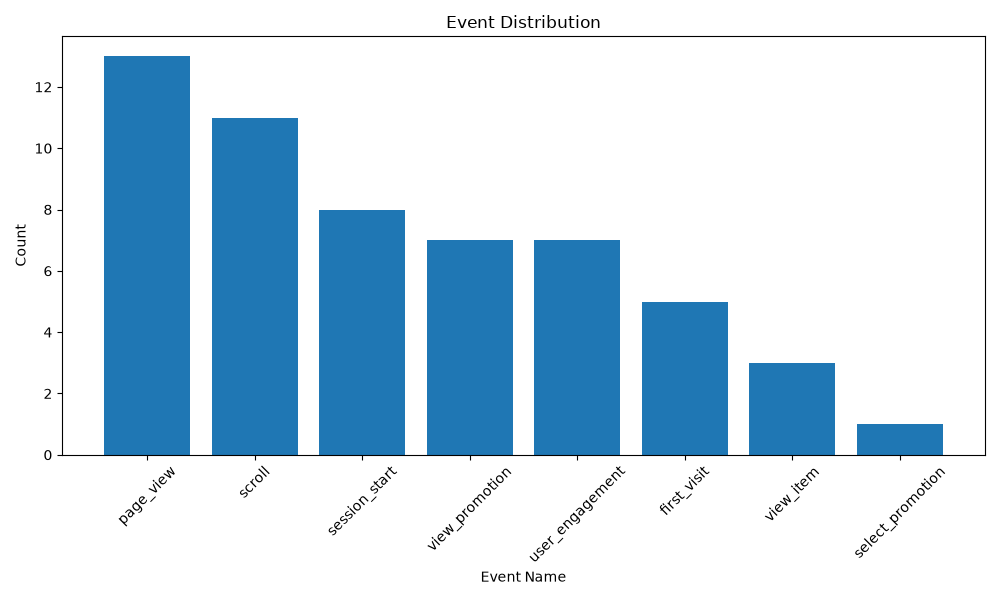
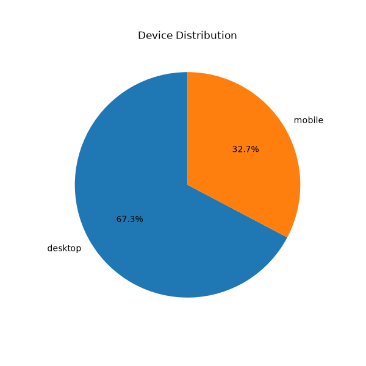
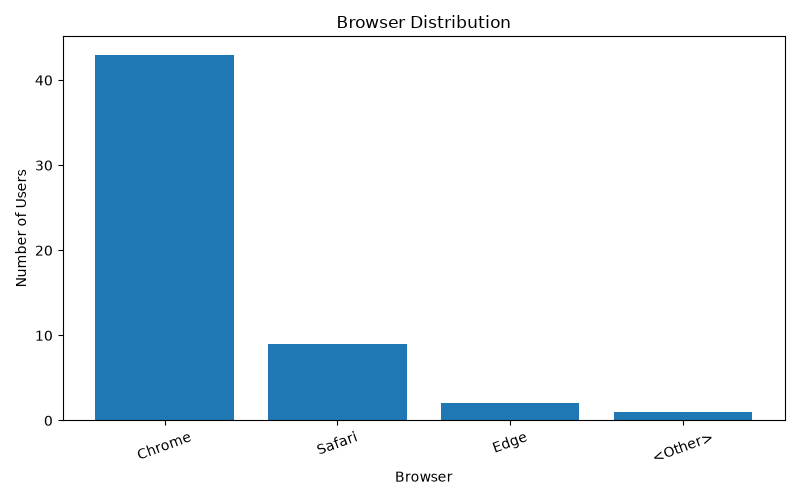
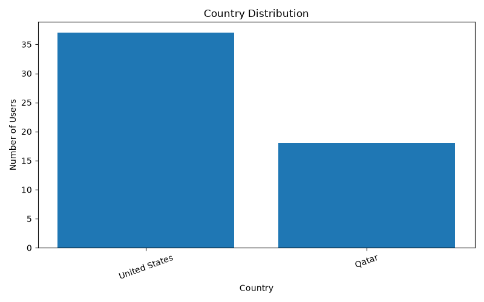
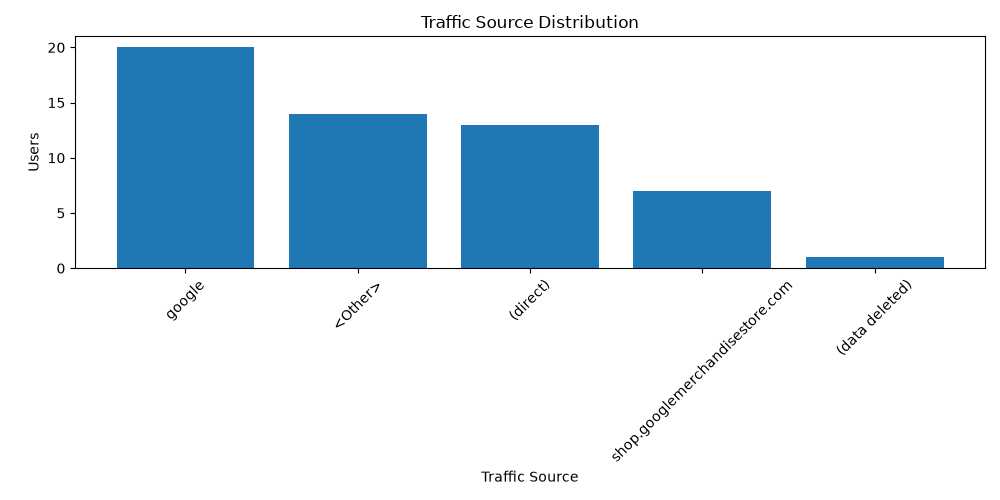
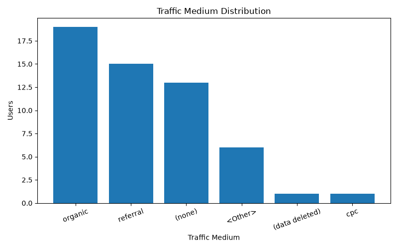

# 🤖 Click-Bot Attribution & Ad-Fraud-Auditor

A Data Analytics & Machine Learning project that detects suspicious bot traffic in Google Analytics (GA4) data, cleans marketing attribution, and calculates more accurate Return on Ad Spend (ROAS).

---

# 📌 Problem Statement

Digital marketing campaigns often suffer from bot traffic and fraudulent interactions that inflate website visits, clicks, and conversions. This results in inaccurate marketing reports and wasted advertising budgets.

This project builds a Python-based auditing system that analyzes Google Analytics data, identifies suspicious traffic patterns, and provides cleaner business insights.

---

# 🎯 Project Objectives

- Load and clean Google Analytics data
- Perform Exploratory Data Analysis (EDA)
- Visualize website traffic patterns
- Engineer features for bot detection
- Detect suspicious traffic using Isolation Forest
- Build an interactive Power BI dashboard
- Calculate Adjusted ROAS using cleaned data

---

# 🛠️ Tech Stack

- Python
- Pandas
- NumPy
- Matplotlib
- Scikit-Learn *(Upcoming)*
- Power BI *(Upcoming)*
- Git & GitHub
- VS Code

---

# 📂 Project Structure

```text
Click-Bot-Attribution-Ad-Fraud-Auditor
│
├── data
│   ├── raw
│   │   └── ga4_event_2021.csv
│   │
│   └── processed
│       └── clean_ga4_data.csv
│
├── reports
│   └── figures
│       ├── event_distribution.png
│       ├── device_distribution.png
│       ├── browser_distribution.png
│       ├── country_distribution.png
│       ├── traffic_source_distribution.png
│       └── traffic_medium_distribution.png
│
├── src
│   ├── main.py
│   ├── load_data.py
│   ├── explore_data.py
│   ├── data_quality.py
│   ├── clean_data.py
│   ├── eda.py
│   └── visualize_data.py
│
├── README.md
├── requirements.txt
└── .gitignore
```

---

# 📊 Dataset

**Google Analytics 4 Obfuscated Sample Ecommerce Dataset**

Source:
https://www.kaggle.com/datasets/google/google-analytics-sample

---

# ✅ Completed Work

## Day 1 – Project Setup

- Created project structure
- Configured virtual environment
- Initialized GitHub repository
- Loaded GA4 dataset

---

## Day 2 – Dataset Understanding

- Explored dataset columns
- Understood GA4 event-level data
- Identified important marketing attributes

---

## Day 3 – Data Cleaning

Performed:

- Duplicate removal
- Missing value analysis
- Empty column removal

### Dataset Summary

| Stage | Rows | Columns |
|-------|-----:|--------:|
| Raw Dataset | 500 | 94 |
| Clean Dataset | 210 | 55 |

---

## Day 4 – Exploratory Data Analysis

Analyzed:

- Event Distribution
- Device Distribution
- Browser Distribution
- Country Distribution
- Traffic Source
- Traffic Medium

### Key Insights

- **Page View** is the most common event.
- Most users access the website from **Desktop** devices.
- **Chrome** is the dominant browser.
- Majority of traffic comes from the **United States**.
- **Google Organic Search** is the primary traffic source.

---

## Day 5 – Data Visualization

Created professional visualizations using Matplotlib:

- Event Distribution
- Device Distribution
- Browser Distribution
- Country Distribution
- Traffic Source Distribution
- Traffic Medium Distribution

All charts are automatically saved inside:

```text
reports/figures/
```

---

# 📈 Current Workflow

```text
Google Analytics Dataset
        │
        ▼
Load Data ✅
        │
        ▼
Understand Dataset ✅
        │
        ▼
Data Quality Check ✅
        │
        ▼
Data Cleaning ✅
        │
        ▼
Exploratory Data Analysis ✅
        │
        ▼
Data Visualization ✅
        │
        ▼
Feature Engineering 🔄
        │
        ▼
Bot Detection
        │
        ▼
Isolation Forest
        │
        ▼
Power BI Dashboard
        │
        ▼
Adjusted ROAS
```

---

# 📊 Visualizations

## Event Distribution



---

## Device Distribution



---

## Browser Distribution



---

## Country Distribution



---

## Traffic Source Distribution



---

## Traffic Medium Distribution



---

# 💼 Skills Demonstrated

- Python Programming
- Pandas
- Data Cleaning
- Exploratory Data Analysis
- Data Visualization
- Git & GitHub
- Marketing Analytics
- Business Intelligence

---

# 🚀 Upcoming Features

- Feature Engineering
- Rule-Based Bot Detection
- Isolation Forest Model
- Bot Traffic Scoring
- Power BI Dashboard
- Marketing Attribution Audit
- Adjusted ROAS Calculation

---

# 📊 Current Progress

**Project Status:** **60% Complete**

```text
████████████████████████████████░░░░

✅ Project Setup
✅ Data Loading
✅ Data Understanding
✅ Data Cleaning
✅ Exploratory Data Analysis
✅ Data Visualization

🔄 Feature Engineering

⬜ Rule-Based Bot Detection
⬜ Isolation Forest
⬜ Power BI Dashboard
⬜ Final Documentation
```

---

# 👨‍💻 Author

**Pranav Pawar**

B.Tech Computer Science Engineering

GitHub: https://github.com/Pranav497